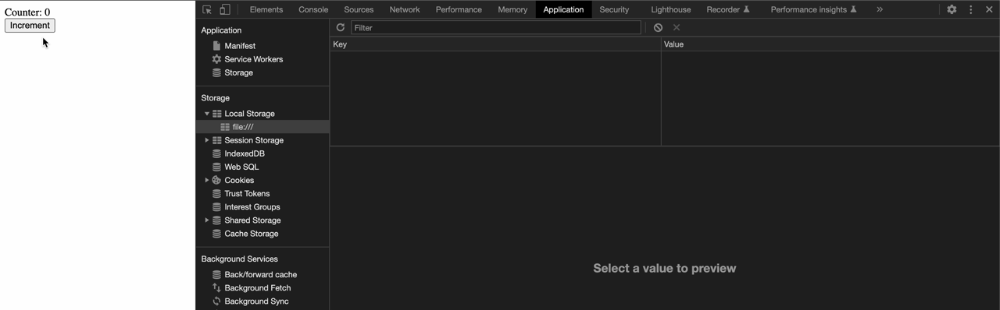

# Using LocalStorage for state in Preact

Experimental Preact component bundle that uses LocalStorage to manage state. Bundles to ~4.5kB.

Shows tracking a counter state via LocalStorage.

## Why is this useful?

1. Preact is smaller and lighter weight than React
2. Context requires rendering under common root and sharing same provider and can't always be used
3. Synchronous across tabs with no polling
4. Nest JSON compatible pieces of state under one LocalStorage key

## Why is this not useful?

1. LocalStorage is highly mutable. Don't use this for anything remotely sensitive.
2. This is not a state management system like Redux (though you probably don't need that either lol)
3. LocalStorage is persistent, it's not always a good representation of page state.

## Build

Generate the bundle with:

`npm run build`

`iife.js` is the main output, though the components can be used separately through the ESM build.

## Demo

`open index.html`
